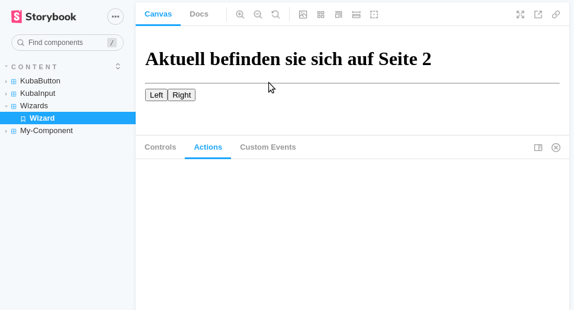

# storybook-addon-custom-event-broadcaster

Custom panel tab to send custom events to components.

This addon adds a tab to the addon panel. It has a set of input fields. The input of these fields are used to create a [custom event](https://developer.mozilla.org/en-US/docs/Web/Events/Creating_and_triggering_events).

| Input         |                    functionality                    |
| ------------- | :-------------------------------------------------: |
| EventName     |                  Name of the event                  |
| Data          |        custom data, to be send in the event         |
| Selector      | the selector of the node the event will be fired on |
| "send"-Button |               Push to send the event                |

#### Install

```bash
npm install storybook-addon-custom-event-broadcaster
```

Add the addon to the storybook configuration:

```bash
// .storybook/main.js
module.exports = {
 ...
  addons: [
   ...
    'storybook-addon-custom-event-broadcaster',
  ],
};
```

#### Configuration in your story

To configure your story you need to add an _customEventPanel_-object to the parameters section. it has one required parameter _eventName_ and two optional parameters _eventData_,_selector_. It is analogous to the three input fields.

If the _selector_-field is empty, the event will be fired on the document-object of the page. if it is filled it will fire the event on the selected node.

```js
// \*.stories.jsx
// example configuration of 3 lines
export default {
  title: "Content/MyStory",
  parameters: {
    customEventPanel: [
      {
         eventName: "event:example",
      }
      {
        eventName: "my:event",
        eventData: {
          opt: 23,
        },
        selector: ".selector",
      },
      {
        eventName: "my:otherevent",
        eventData: {
          foo: 23,
        },
      },
    ],
  },
  argTypes: {},
};
```

#### Plugin in Action



I have a example project using this addon on https://github.com/derKuba/stenciljs-tutorial/tree/main/component-lib.
